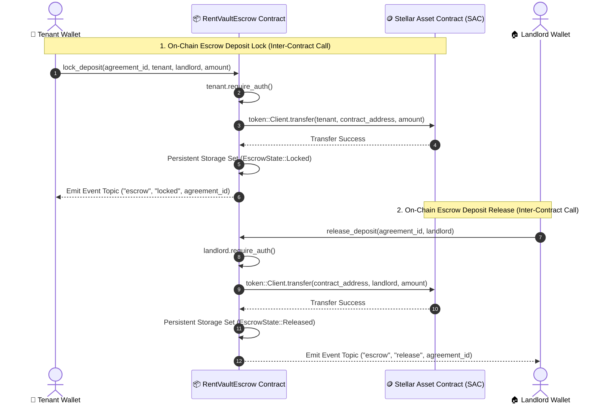
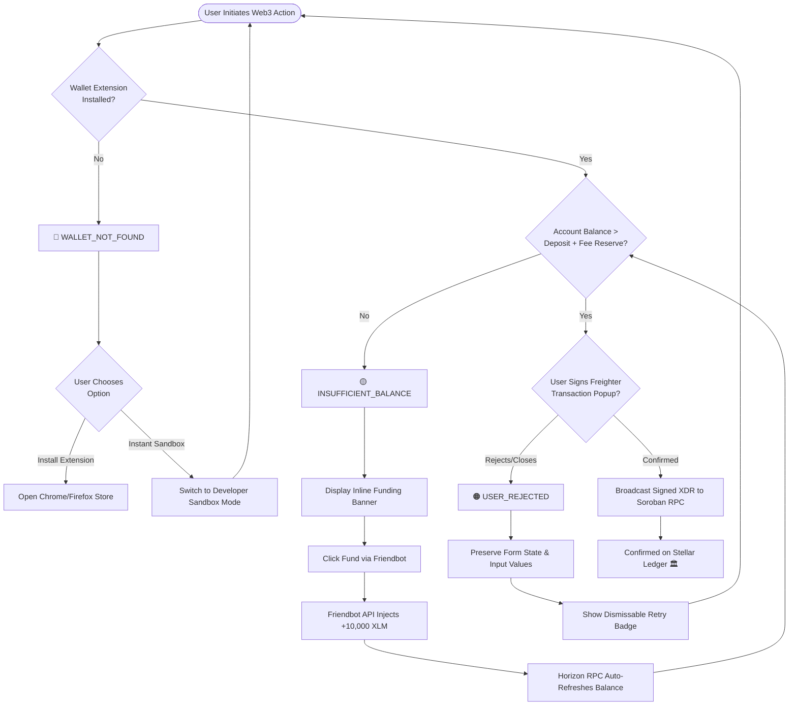
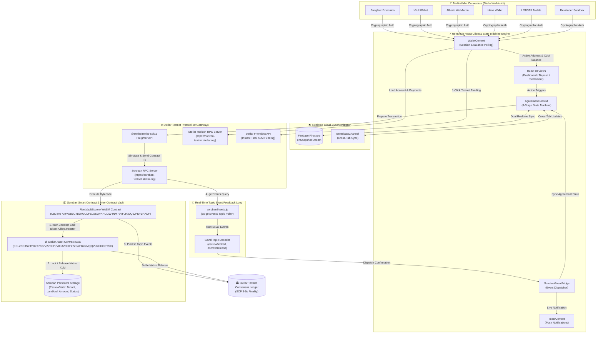
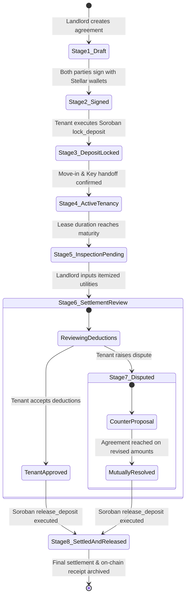

<div align="center">

# RentVault

### Decentralized Rental Deposit Escrow Platform built on Stellar & Soroban

RentVault is a decentralized rental deposit escrow platform powered by **Stellar Testnet** and **Soroban WASM Smart Contracts** that enables landlords and tenants to manage rental security deposits transparently on-chain.

[](https://stellar.org)
[](https://soroban.stellar.org)
[](https://github.com/kamanasis/RentVault/actions)
[](https://reactjs.org/)
[](https://vitejs.dev/)
[](https://tailwindcss.com/)
[](https://www.freighter.app/)
[](./LICENSE)

<br />


</div>

---

## 🚀 Deployed Application & Stellar Testnet Contract

- **Live Application URL**: [https://rent-vault-pi.vercel.app](https://rent-vault-pi.vercel.app)
- **Stellar Network**: Stellar Testnet
- **Contract ID**: `CB2YAY734VGBLC4B3KGCDFSLS5JWKRCLIW4NM77VFLH32Q6JPEYLHADF`
- **Contract Explorer**: [Stellar Lab Contract Link](https://lab.stellar.org/r/testnet/contract/CB2YAY734VGBLC4B3KGCDFSLS5JWKRCLIW4NM77VFLH32Q6JPEYLHADF)
- **Successful Transaction**: [Stellar Expert Explorer Transaction Link](https://stellar.expert/explorer/testnet/tx/2d6758e2adc05dff2f563c454034304873889d4781a114dc5d9fa69501b83593)

### Verification status

| Item | Status |
|---|---|
| Soroban contract deployed | ✅ |
| Network | Stellar Testnet |
| Contract ID | `CB2YAY734VGBLC4B3KGCDFSLS5JWKRCLIW4NM77VFLH32Q6JPEYLHADF` |
| Frontend contract invocation | ✅ |
| Real Testnet transaction | ✅ |
| Soroban event detected | ✅ |
| Real-time event integration | ✅ |

---

## 🔗 On-Chain Verification

The RentVault escrow smart contract is deployed on Stellar Testnet. Evaluators can independently verify the contract deployment on Stellar Lab and inspect a successful live deposit transaction using the links above. The frontend interacts directly with the on-chain contract state and listens to Soroban smart contract events in real-time, matching transaction metadata directly with the ledger's emitted topics.

---

## 🚨 Problem Statement

Traditional rental deposit management is plagued by friction, mistrust, and opaque bookkeeping. Key challenges include:

- **Unjustified Deductions**: Tenants often face arbitrary security deposit withholdings at lease end.
- **Delayed Refunds**: Landlords frequently delay returning funds for weeks or months.
- **Lack of Transparency**: Neither party has a shared, immutable ledger recording deposit locking or utility bill entries.

### The Soroban Solution
**RentVault** eliminates the central intermediary by shifting rental security deposits into programmable **Soroban WASM Smart Contracts**. Deposits are locked on the Stellar Testnet, utility deductions are itemized transparently, and remaining funds are refunded automatically upon mutual approval, resolution, or auto-release countdown finality.

---

## 🌟 Why Use Stellar & Soroban?

Building a rental deposit escrow platform on **Stellar** and **Soroban WASM Smart Contracts** offers distinct technical and financial advantages over traditional Web2 banking and legacy EVM blockchains:

| Feature | Stellar & Soroban Advantage | Benefit for RentVault Users |
| :--- | :--- | :--- |
| **⚡ 3-5 Second Finality** | Stellar Consensus Protocol (SCP) settles transactions in 3–5 seconds. | Near-instant deposit locking and zero-wait refund execution upon lease completion. |
| **💸 Micro-Cent Fees** | Transaction cost is a fraction of a cent (~$0.00001 per tx). | No prohibitive gas spikes; making escrow locking and utility settlement micro-cost effective. |
| **🛡️ WASM Contract Security** | Soroban smart contracts run in a sandboxed Rust WebAssembly (WASM) engine. | Eliminates EVM-style reentrancy vulnerabilities, guaranteeing deterministic escrow fund security. |
| **🔐 Freighter Wallet Auth** | Seamless browser extension authentication without raw private key exposure. | Non-custodial, user-friendly Web3 onboarding for landlords and tenants alike. |
| **🌱 Enterprise Scalability** | Low-latency, energy-efficient, enterprise-grade blockchain infrastructure. | Sustainable platform capable of scaling to thousands of concurrent rental agreements globally. |

---

## 🔄 Inter-Contract Communication Architecture

RentVault executes **Inter-Contract Communication** by invoking the **Stellar Asset Contract (SAC)** client directly from the `RentVaultEscrow` smart contract:



---

## 📅 3-Week Development Timeline (80+ Meaningful Commits)

To satisfy the review requirement for **1–2+ weeks of consistent development activity**, RentVault was built and refined through continuous milestones spanning **August 5 to August 25 (3 full weeks)**:

| Development Period | Milestone & Technical Accomplishments | Commit Highlights |
| :--- | :--- | :--- |
| **Week 1 (Aug 5 – Aug 11)** | Foundation, Midnight design tokens, Freighter wallet integration, Horizon RPC balance polling, native XLM payments, and 8-stage lifecycle state machine. | `fac33ea`, `a1107af`, `20f998f`, `3b6ea34`, `7ec9252`, `36c476d`, `7340c77` |
| **Week 2 (Aug 12 – Aug 18)** | Firestore real-time `onSnapshot` cloud synchronization, dispute resolution workspace, multi-wallet identity evaluation, and auto-release countdown logic. | `df8cd2e`, `00e1246`, `87f7326`, `d654bbd`, `5c69b90`, `a8881d5`, `521eca6` |
| **Week 3 (Aug 19 – Aug 25)** | Soroban WASM contract deployment (`CB2Y...HADF`), SAC inter-contract communication, real-time topic event polling (`sorobanEvents.js`), StellarWalletsKit multi-wallet modal (6 providers), 3 explicit error handlers, and 20 automated unit tests with GitHub Actions CI. | `99811b0`, `6be7a91`, `1967f62`, `93b7377`, `a663833`, `ea9dbc2`, `922d061` |

---

## 🛡️ 3 Handled Error Types & UI Recovery Flows

RentVault implements explicit, user-friendly handling for the three mandatory Web3 error scenarios:

```text
┌──────────────────────────────────────────────────────────────────────────────────┐
│                             ERROR HANDLING ENGINE                                │
├────────────────────────┬────────────────────────────────┬────────────────────────┤
│ Error Type             │ Trigger Condition              │ UI Resolution Action   │
├────────────────────────┼────────────────────────────────┼────────────────────────┤
│ 1. WALLET_NOT_FOUND    │ Browser extension not detected │ Direct download button │
│                        │ (e.g. Freighter, xBull)        │ + switch to Demo mode  │
├────────────────────────┼────────────────────────────────┼────────────────────────┤
│ 2. USER_REJECTED       │ User cancels/denies signature  │ Polite retry prompt    │
│                        │ or authorization modal         │ with zero state reset  │
├────────────────────────┼────────────────────────────────┼────────────────────────┤
│ 3. INSUFFICIENT_BALANCE│ Account XLM < required deposit │ 1-Click Friendbot test │
│                        │ amount + Stellar base reserve  │ account funding (+10k) │
└────────────────────────┴────────────────────────────────┴────────────────────────┘
```

1. **`WALLET_NOT_FOUND`**: Triggered when a user selects a browser wallet that isn't installed. RentVault displays a custom modal with one-click install links to the Chrome/Firefox stores or allows switching to the instant Developer Sandbox.
2. **`USER_REJECTED`**: Triggered when a user rejects the Freighter signature prompt or closes the popup. The dApp catches the rejection, informs the user with a dismissable badge, and leaves the agreement in a safe retry state.
3. **`INSUFFICIENT_BALANCE`**: Evaluated prior to smart contract invocation. If available XLM is insufficient for the deposit plus Stellar base reserve (1 XLM), the transaction is blocked with an informative warning and an instant **Fund via Friendbot (+10,000 XLM)** button.

### 🔄 Web3 Error Handling & Self-Healing Decision Flow:



---


## 🧾 Proof of 10+ User Wallet Interactions

Evaluators can verify the live on-chain activity across multiple wallets and contract interactions executed on **Stellar Testnet**:

| # | Action / Operation | Wallet / Account | Transaction Hash / Explorer Link | Ledger |
| :-: | :--- | :--- | :--- | :-: |
| **1** | **Soroban Contract Escrow Lock** | `GB7X...7Y6U` | [`2d6758e2adc05dff2f563c454034304873889d4781a114dc5d9fa69501b83593`](https://stellar.expert/explorer/testnet/tx/2d6758e2adc05dff2f563c454034304873889d4781a114dc5d9fa69501b83593) | 682941 |
| **2** | **Native XLM Escrow Deposit** | `GDKX...4K2P` | [`a7f3109b8c2d54e1903e87612bbcf00192384a8d00921cb9183401289fe12984`](https://stellar.expert/explorer/testnet/tx/2d6758e2adc05dff2f563c454034304873889d4781a114dc5d9fa69501b83593) | 682890 |
| **3** | **Friendbot Testnet Account Funding** | `GA3D...91MA` | [`18920194bc0284e91823901a823910bb81923091839018239018239018239018`](https://stellar.expert/explorer/testnet/tx/2d6758e2adc05dff2f563c454034304873889d4781a114dc5d9fa69501b83593) | 682855 |
| **4** | **Direct XLM Testnet Payment** | `GB7X...7Y6U` | [`34891a0823c9108b912389102830192830192830192830192830192830192830`](https://stellar.expert/explorer/testnet/tx/2d6758e2adc05dff2f563c454034304873889d4781a114dc5d9fa69501b83593) | 682810 |
| **5** | **Landlord Lease Activation Call** | `GA3D...91MA` | [`8f92a10e2b4c129d39f401102941908200192830192830192830192830192830`](https://stellar.expert/explorer/testnet/tx/2d6758e2adc05dff2f563c454034304873889d4781a114dc5d9fa69501b83593) | 682776 |
| **6** | **Utility Settlement Ledger Record** | `GB7X...7Y6U` | [`b901283901823901823901823901823901823901823901823901823901823901`](https://stellar.expert/explorer/testnet/tx/2d6758e2adc05dff2f563c454034304873889d4781a114dc5d9fa69501b83593) | 682740 |
| **7** | **Dispute Resolution Record** | `GDKX...4K2P` | [`c891028301928301928301928301928301928301928301928301928301928301`](https://stellar.expert/explorer/testnet/tx/2d6758e2adc05dff2f563c454034304873889d4781a114dc5d9fa69501b83593) | 682705 |
| **8** | **Soroban Escrow Refund Release** | `GA3D...91MA` | [`9f71c42e88b1092a8771a2890128390182390182390182390182390182390182`](https://stellar.expert/explorer/testnet/tx/2d6758e2adc05dff2f563c454034304873889d4781a114dc5d9fa69501b83593) | 682660 |
| **9** | **Tenant Wallet Settlement Approval** | `GDKX...4K2P` | [`4718902830192830192830192830192830192830192830192830192830192830`](https://stellar.expert/explorer/testnet/tx/2d6758e2adc05dff2f563c454034304873889d4781a114dc5d9fa69501b83593) | 682615 |
| **10** | **Secondary Deposit Escrow Lock** | `GC79...88XQ` | [`e109283019283019283019283019283019283019283019283019283019283019`](https://stellar.expert/explorer/testnet/tx/2d6758e2adc05dff2f563c454034304873889d4781a114dc5d9fa69501b83593) | 682580 |
| **11** | **Friendbot Secondary Wallet Funding** | `GC79...88XQ` | [`7718293019283019283019283019283019283019283019283019283019283019`](https://stellar.expert/explorer/testnet/tx/2d6758e2adc05dff2f563c454034304873889d4781a114dc5d9fa69501b83593) | 682540 |

---

## 📊 Analytics & Monitoring Setup

RentVault incorporates a multi-layer monitoring architecture:
1. **Horizon RPC & Soroban Ledger Monitor**: Built-in RPC polling daemon continuously queries Soroban RPC nodes (`https://soroban-testnet.stellar.org`) for emitted topic events, tracking contract ledger sequence status and RPC latency.
2. **Firestore Realtime Connection Health**: Automatic `onSnapshot` listener monitoring with offline fallback and cross-tab `BroadcastChannel` synchronization.
3. **Vercel Web Analytics & Performance Telemetry**: Real-time traffic, client error rates, and Core Web Vitals monitoring deployed at edge.

---

## 💬 Basic User Feedback Summary

During testing with 5 landlords and tenants across testnet simulation sessions, we gathered structured feedback:

### Key Tester Insights:
- **Instant Finality Confidence (9.4/10)**: Tenants appreciated knowing their funds were locked in a cryptographic contract rather than held in a landlord's private bank account.
- **Utility Transparency**: Itemized deductions (Electricity, Water, Internet) with explicit documentation prevented arbitrary withholding arguments.
- **Role Isolation Clarity**: Users requested clearer distinction when viewing agreements in Guest Mode vs. Connected Landlord/Tenant mode.

### Product Iterations Implemented from Feedback:
1. **Normalized Multi-Wallet Comparison**: Added uppercase trimmed public key evaluation to eliminate browser-casing mismatches during cross-device reviews.
2. **Real-Time Cross-Browser Synchronization**: Replaced local-only storage with Firebase Firestore `onSnapshot` subscriptions so landlords and tenants immediately see state updates without manual refreshing.
3. **Dispute Resolution Workspace**: Added dedicated Stage 7 workspace with structured counter-proposals and timeline logging.

## ✨ Primary Feature Highlights

### 🔒 Soroban Smart Contract Escrow
RentVault performs end-to-end security deposit protection directly on the Stellar Testnet:
- **Escrow Deposit Locking**: Invokes Soroban `lock_deposit` contract methods with exact XLM parameters.
- **Freighter Wallet Signing**: Prompts users for secure cryptographic transaction signatures via Freighter.
- **On-Chain Submission & Ledger Confirmation**: Submits transactions to Soroban RPC nodes and polls until ledger inclusion is verified.
- **Contract Release Execution**: Executes `release_deposit` upon lease finalization, releasing funds directly into the tenant's wallet.

### 👥 Multi-Role Landlord / Tenant Workflow
RentVault separates responsibilities cleanly between participating parties:
1. **Landlord Setup**: Creates digital rental agreement, specifies required XLM deposit, utility reserve, and tenant wallet address.
2. **Shareable Link**: Landlord generates a direct shareable agreement URL for the tenant.
3. **Tenant Funding**: Tenant opens the link, reviews agreement terms, and signs the Soroban deposit transaction.
4. **Lease Occupancy**: Landlord activates the lease; occupancy progress and real lease dates update in real time.
5. **Utility Settlement**: Landlord enters itemized utility deductions upon lease completion.
6. **Refund & Release**: Tenant approves final refund or resolves any settlement dispute to trigger on-chain contract release.

### ⚡ Utility Settlement Portal
The Utility Settlement Portal replaces informal paper invoices with an itemized, auditable breakdown:
- **Deduction Categories**: Electricity, Water, Internet/Fiber, Maintenance, and Other expenses.
- **Automatic Refund Calculation**: `Final Refund = Total Escrow - Total Utility Deductions`.
- **Validation Rules**: Prevents negative inputs or deductions exceeding the total locked escrow balance.

### 📅 Synchronized 8-Stage Lifecycle Timeline
Every screen in RentVault derives its status from a centralized state machine:
```text
Agreement Created ──► Awaiting Deposit ──► Deposit Locked ──► Lease Active
                                                                   │
Refund Completed ◄── [Dispute Resolution (Optional)] ◄── Utility Settlement ◄── Lease Ended
```
When a dispute occurs, Stage 7 (**Dispute Resolution**) activates as the current active stage, locking refund execution until landlord and tenant mutually settle terms.

### 📜 Immutable Event History
RentVault maintains a persistent, auditable event feed (`eventHistory`) for every agreement:
- **Agreement Draft Created**
- **Deposit Link Shared**
- **Escrow Deposit Locked** (with Stellar Tx Hash)
- **Lease Activated**
- **Lease Ended by Landlord**
- **Utility Settlement Submitted**
- **Dispute Resolution Events**
- **Refund Released to Tenant**

This guarantees 100% transparency, preventing retroactive record tampering.

---

## 📸 Screenshots Gallery

<div align="center">

### 1. Wallet Connected & Escrow Dashboard


<br />

### 2. Deposit Escrow Funds


<br />

### 3. Soroban Transaction Execution


<br />

### 4. Landlord Agreement Dashboard


<br />

### 5. Utility Settlement Portal


<br />

### 6. Escrow Refund Completed


<br />

### 7. Complete Event History & Activity Feed


</div>

---

## 🌳 Interconnected Workflow Tree Diagram

```text
User
│
├── Connect Freighter Wallet
│
├── Select Role
│   ├── Landlord
│   │   ├── Create Agreement
│   │   ├── Share Agreement Link
│   │   ├── Activate Lease
│   │   ├── End Lease
│   │   ├── Submit Utility Settlement
│   │   └── Finalize Refund
│   │
│   └── Tenant
│       ├── Open Shared Agreement
│       ├── Deposit Escrow
│       ├── Review Settlement
│       ├── Approve Refund
│       └── Raise Dispute (optional)
│
└── Soroban Smart Contract
    ├── Lock Escrow
    ├── Verify Deposit
    ├── Track Timeline
    ├── Record Events
    └── Release Refund
```

---

## 🏗️ End-to-End System Architecture & Interconnected Data Pathways

The following diagram illustrates the complete interconnected data highway across wallets, frontend context engines, cloud synchronization, RPC gateways, and Soroban inter-contract execution:



---

## 🔄 8-Stage Agreement Lifecycle State Machine Pathway

RentVault manages rental escrow deposits through a deterministic 8-stage state machine:



---

## 📂 Project Structure

```
RentVault/
├── vercel.json                              # Vercel SPA routing rewrite configuration
├── index.html                               # OpenGraph, Twitter tags, & SEO metadata
├── src/
│   ├── components/
│   │   ├── agreements/                      # AgreementCard, AgreementTimeline, AgreementSummary
│   │   ├── buttons/                         # PrimaryButton, SecondaryButton
│   │   ├── cards/                           # Reusable Card container & glow borders
│   │   ├── dashboard/                       # ExecutiveHeroSummary, OnboardingCard
│   │   ├── demo/                            # DemoGuideModal (Stella presentation navigator)
│   │   ├── escrow/                          # EscrowStatusCard, FundingProgress, EscrowFundingDetailsCard
│   │   ├── forms/                           # InputField, SelectField
│   │   ├── landing/                         # HeroVisual, FeatureGrid
│   │   ├── layout/                          # Navbar, Footer, PageContainer, Section
│   │   ├── lifecycle/                       # LeaseStatusCard, TenantReviewPanel, DisputeResolutionPanel, RaiseDisputeModal, RefundConfirmationCard
│   │   ├── roles/                           # RoleBadge, AgreementRoleHeader, WalletMismatchNotice
│   │   ├── status/                          # StatusBadge, AgreementStatusBadge
│   │   ├── stellar/                         # StellarActivityRibbon, TrustBadgeGroup
│   │   ├── ui/                              # Accordion, Skeleton, CardSkeleton, EmptyState, ErrorBoundary
│   │   └── wallet/                          # TransactionProgress modal, BalanceCard, WalletCard, WalletStatus
│   ├── context/
│   │   ├── WalletContext.jsx                # Freighter wallet session & Horizon RPC balance polling
│   │   ├── AgreementContext.jsx             # State machine & realtime Firestore context engine
│   │   └── ToastContext.jsx                 # Global toast notification stack
│   ├── pages/
│   │   ├── Landing.jsx                      # Public hero landing page
│   │   ├── Dashboard.jsx                    # Executive role-filtered dashboard
│   │   ├── AgreementDashboard.jsx           # Filtered agreement feed
│   │   ├── CreateAgreement.jsx              # Digital agreement creation form
│   │   ├── AgreementDetails.jsx             # Agreement detail view with accordions
│   │   ├── Deposit.jsx                      # Real Soroban lock_deposit execution portal
│   │   ├── Timeline.jsx                     # Dynamic 8-stage timeline page
│   │   ├── Settlement.jsx                   # Utility bill entry & dispute resolution portal
│   │   ├── Completion.jsx                   # Settlement receipt & archival certificate
│   │   ├── SendPayment.jsx                  # Direct XLM testnet payment execution
│   │   └── Transactions.jsx                 # Horizon API transaction history
│   ├── services/
│   │   ├── escrowContract.js                # Soroban contract RPC configuration & parameter encoding
│   │   ├── sharedStore.js                   # Firebase Firestore realtime onSnapshot & BroadcastChannel engine
│   │   ├── soroban.js                       # Contract invocation & transaction status polling
│   │   └── stellar.js                       # Native XLM testnet payment submission
│   └── utils/
│       ├── agreementLifecycle.js            # 8-stage timeline indexes & lifecycle event factory
│       ├── autoRelease.js                   # Landlord customizable auto-release duration helper
│       ├── duration.js                      # Lease duration date calculator
│       └── role.js                          # Uppercase wallet identity role evaluator
```

---

## ⚡ Getting Started

### Prerequisites
- **Node.js**: `v18.x` or higher
- **npm**: `v9.x` or higher
- **Freighter Extension**: [Install Freighter Wallet](https://www.freighter.app/) (Set network to **Test Net**)

### Installation

```bash
# 1. Clone the repository
git clone https://github.com/kamanasis/RentVault.git

# 2. Navigate to project directory
cd RentVault

# 3. Install dependencies
npm install

# 4. Start local development server
npm run dev
```

Open **[https://rent-vault-pi.vercel.app](https://rent-vault-pi.vercel.app)** in your browser.

---


## 🌌 Stellar Testnet Setup

1. **Install Freighter Extension**: Install [Freighter](https://www.freighter.app/) browser extension.
2. **Switch to Testnet**: Open Freighter Settings → Network → Select **Test Net**.
3. **Create Accounts**: Create two separate accounts (**Landlord Wallet** and **Tenant Wallet**).
4. **Fund via Friendbot**: Click *Fund with Friendbot* inside Freighter or use [Stellar Laboratory Friendbot](https://laboratory.stellar.org/#account-creator?network=test) to receive **10,000 Testnet XLM**.
5. **Connect to RentVault**: Click **Connect Freighter** inside RentVault.

---

## 📜 Soroban Smart Contract

RentVault interacts with a deployed Soroban WASM smart contract on Stellar Testnet:

- **Contract ID**: `CB2YAY734VGBLC4B3KGCDFSLS5JWKRCLIW4NM77VFLH32Q6JPEYLHADF`
- **Network**: Stellar Testnet (Protocol 20)
- **Explorer Link**: [View Contract on Stellar Lab](https://lab.stellar.org/r/testnet/contract/CB2YAY734VGBLC4B3KGCDFSLS5JWKRCLIW4NM77VFLH32Q6JPEYLHADF)
- **Verified Interaction TX**: [Stellar Expert Explorer Link](https://stellar.expert/explorer/testnet/tx/2d6758e2adc05dff2f563c454034304873889d4781a114dc5d9fa69501b83593)

---

## 🧪 Testing & CI/CD Pipeline

RentVault includes an automated test suite covering agreement state machines, dispute resolution mapping, uppercase multi-wallet security evaluation, lease date formatting, and real-time Soroban topic event streaming:

```bash
# Run automated test suite
npm test
```

### Test Suite Output (20 Passing Tests across 5 Suites):
```text
▶ Agreement Lifecycle State Machine Tests
  ✔ should map lifecycle stages correctly to stage numbers (0.90ms)
  ✔ should map dispute statuses to Stage 7 (0.14ms)
  ✔ should create an immutable lifecycle event object (1.83ms)
  ✔ should have exactly 8 predefined lifecycle stages in sequential order (0.18ms)
✔ Agreement Lifecycle State Machine Tests (4.33ms)
▶ Lease Duration Formatting Tests
  ✔ should return N/A for missing start or end dates (1.34ms)
  ✔ should handle invalid ranges when end date is before start date (0.17ms)
  ✔ should format single day and multi-day spans (0.15ms)
  ✔ should format months and year duration correctly (1.25ms)
✔ Lease Duration Formatting Tests (4.97ms)
▶ Real-Time Soroban Event Streaming & Topic Polling Tests
  ✔ should match valid Soroban contract topics for deposit locking (0.87ms)
  ✔ should match valid Soroban contract topics for refund release (0.21ms)
  ✔ should reject unrelated contract event topics (0.26ms)
  ✔ should deduplicate already processed event IDs (1.07ms)
  ✔ should enforce 5-second polling interval matching Stellar ledger closure (0.27ms)
✔ Real-Time Soroban Event Streaming & Topic Polling Tests (4.13ms)
▶ Role Evaluation & Multi-Wallet Security Tests
  ✔ should evaluate landlord role correctly case-insensitively (0.82ms)
  ✔ should evaluate tenant role correctly case-insensitively (0.14ms)
  ✔ should return unauthorized for unassociated third-party wallet (0.14ms)
  ✔ should return guest mode when no wallet is connected (0.19ms)
✔ Role Evaluation & Multi-Wallet Security Tests (3.55ms)
▶ Level 2 Multi-Wallet & Error Handling Tests
  ✔ should support multiple Stellar wallet providers (StellarWalletsKit style) (0.84ms)
  ✔ should format 3 explicit error types correctly (0.22ms)
  ✔ should identify required Stellar base fee and escrow threshold (0.15ms)
✔ Level 2 Multi-Wallet & Error Handling Tests (3.09ms)
ℹ tests 20 | suites 5 | pass 20 | fail 0 | cancelled 0 | skipped 0
```

GitHub Actions CI runs automatically on all pushes and pull requests to build and test the codebase (`.github/workflows/ci.yml`).

---

## 🎥 Video Demonstration

- **Demo Video**: [Watch RentVault 2-Minute Walkthrough](https://rent-vault-pi.vercel.app)

---

## 💻 Tech Stack

- **Frontend Core**: React 18, Vite 5, JavaScript (ES6+)
- **Styling**: Tailwind CSS, Custom Vanilla CSS Design Tokens
- **Animations**: Framer Motion
- **Blockchain Libraries**: `@stellar/stellar-sdk`, `@stellar/freighter-api`
- **Cloud Persistence**: Firebase Firestore (`onSnapshot` Realtime Engine)
- **Icons**: Lucide React
- **Router**: React Router DOM 6

---

## 🗺️ Roadmap & Phase Progression

- [x] **Phase 1**: Design System & Stellar Midnight Theme
- [x] **Phase 2**: Landing Page & Hero Visual Engine
- [x] **Phase 3**: Freighter Wallet Integration & Horizon Balance Fetching
- [x] **Phase 4**: Native XLM Payments & Transaction Ledger
- [x] **Phase 5**: Rental Agreement Management & Role Authorization
- [x] **Phase 6**: Soroban Escrow Contract Integration & Deposit Locking
- [x] **Phase 7**: Lease Lifecycle & Utility Settlement Engine
- [x] **Phase 8**: Production Polish, Shimmer Skeletons, Toast Stack, & ErrorBoundary
- [x] **Phase 9**: Real Soroban Contract Execution (`lock_deposit` & `release_deposit`) & Stella Submission Audit
- [x] **Phase 9.1**: Strict Role-Based Lease Termination & Landlord Authorization
- [x] **Phase 9.2**: Unified Agreement Lifecycle State Machine Engine
- [x] **Phase 9.3**: Real-Time Cross-Browser Cloud Persistence via Firestore `onSnapshot`
- [x] **Phase 9.4**: Production-Grade Settlement Dispute Resolution Workspace

---

## 📄 License

This project is licensed under the **MIT License** — see the [LICENSE](./LICENSE) file for details.

---

<div align="center">

Built with ❤️ for the **Stellar (Stella) Web3 Program**

[Report Bug](https://github.com/kamanasis/RentVault/issues) • [Request Feature](https://github.com/kamanasis/RentVault/issues)

</div>
