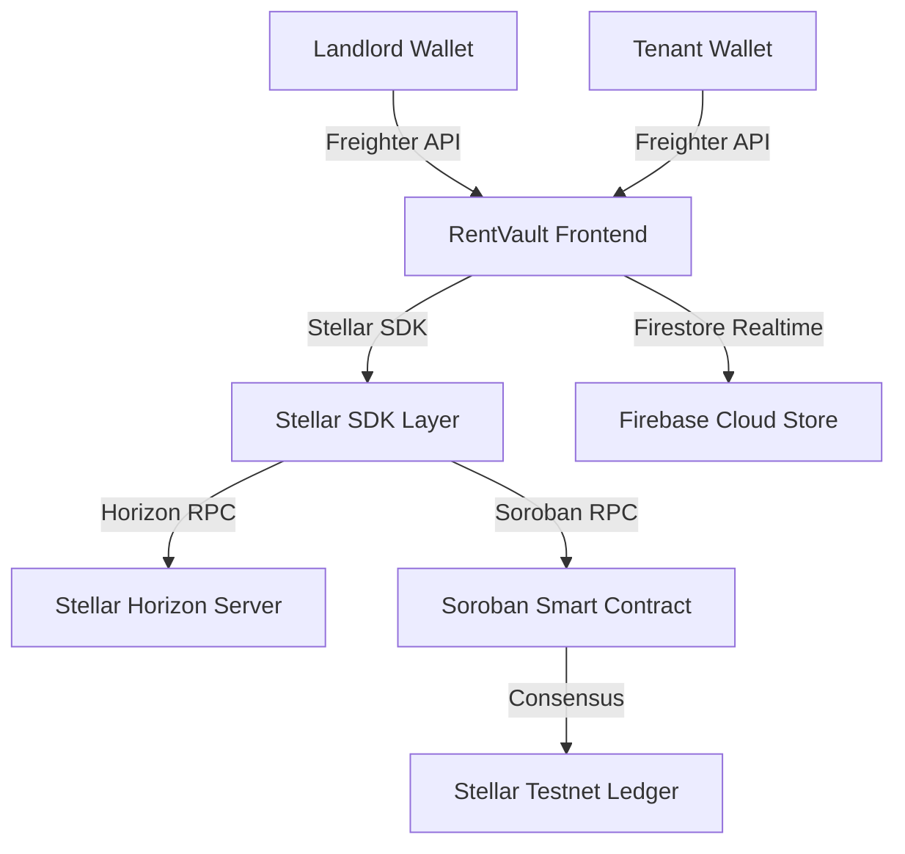

<div align="center">

# RentVault

### Decentralized Rental Deposit Escrow Platform built on Stellar & Soroban

RentVault is a decentralized rental deposit escrow platform powered by **Stellar Testnet** and **Soroban WASM Smart Contracts** that enables landlords and tenants to manage rental security deposits transparently on-chain.

[](https://stellar.org)
[](https://soroban.stellar.org)
[](https://reactjs.org/)
[](https://vitejs.dev/)
[](https://tailwindcss.com/)
[](https://www.freighter.app/)
[](./LICENSE)

<br />


</div>

---

## 🚨 Problem Statement

Traditional rental deposit management is plagued by friction, mistrust, and opaque bookkeeping. Key challenges include:

- **Unjustified Deductions**: Tenants often face arbitrary security deposit withholdings at lease end.
- **Delayed Refunds**: Landlords frequently delay returning funds for weeks or months.
- **Lack of Transparency**: Neither party has a shared, immutable ledger recording deposit locking or utility bill entries.

### The Soroban Solution
**RentVault** eliminates the central intermediary by shifting rental security deposits into programmable **Soroban WASM Smart Contracts**. Deposits are locked on the Stellar Testnet, utility deductions are itemized transparently, and remaining funds are refunded automatically upon mutual approval, resolution, or auto-release countdown finality.

---

## 🌟 Why Use Stellar & Soroban?

Building a rental deposit escrow platform on **Stellar** and **Soroban WASM Smart Contracts** offers distinct technical and financial advantages over traditional Web2 banking and legacy EVM blockchains:

| Feature | Stellar & Soroban Advantage | Benefit for RentVault Users |
| :--- | :--- | :--- |
| **⚡ 3-5 Second Finality** | Stellar Consensus Protocol (SCP) settles transactions in 3–5 seconds. | Near-instant deposit locking and zero-wait refund execution upon lease completion. |
| **💸 Micro-Cent Fees** | Transaction cost is a fraction of a cent (~$0.00001 per tx). | No prohibitive gas spikes; making escrow locking and utility settlement micro-cost effective. |
| **🛡️ WASM Contract Security** | Soroban smart contracts run in a sandboxed Rust WebAssembly (WASM) engine. | Eliminates EVM-style reentrancy vulnerabilities, guaranteeing deterministic escrow fund security. |
| **🔐 Freighter Wallet Auth** | Seamless browser extension authentication without raw private key exposure. | Non-custodial, user-friendly Web3 onboarding for landlords and tenants alike. |
| **🌱 Enterprise Scalability** | Low-latency, energy-efficient, enterprise-grade blockchain infrastructure. | Sustainable platform capable of scaling to thousands of concurrent rental agreements globally. |

---

## 🏆 Stella Level 1 & Level 2 Compliance

RentVault fulfills all core requirements for the **Stellar (Stella) Web3 Program** Level 1 & Level 2 submissions:

| Requirement | Status | Description |
| :--- | :---: | :--- |
| **Freighter Wallet Integration** | ✅ | Cryptographic authentication via Freighter browser extension with public key parsing. |
| **Testnet XLM Transactions** | ✅ | Native XLM transfers and Friendbot testnet funding integration. |
| **Soroban Smart Contract Escrow** | ✅ | WASM contract invocation on Stellar Testnet for security deposit escrow management. |
| **On-Chain Deposit Locking** | ✅ | Real-time `lock_deposit` execution locking 100% of required escrow on-chain. |
| **Landlord/Tenant Multi-Wallet Flow** | ✅ | Dynamic role evaluation isolating permissions for Landlord, Tenant, and Guest views. |
| **Utility Settlement Portal** | ✅ | Itemized bill entry (Electricity, Water, Internet, Maintenance, Other) with live refund calculation. |
| **Refund & Release Execution** | ✅ | Soroban `release_deposit` smart contract invocation transferring XLM back to tenant. |
| **Agreement Timeline Synchronization** | ✅ | Synchronized 8-stage visual timeline driving landing hero, dashboard, and detail views. |
| **Immutable Activity History** | ✅ | Complete 8-stage auditable event feed tracking every state transition with timestamps & TX hashes. |
| **Stellar Expert Transaction Links** | ✅ | Direct explorer links for contract IDs, ledger sequences, and transaction hashes. |

---

## ✨ Primary Feature Highlights

### 🔒 Soroban Smart Contract Escrow
RentVault performs end-to-end security deposit protection directly on the Stellar Testnet:
- **Escrow Deposit Locking**: Invokes Soroban `lock_deposit` contract methods with exact XLM parameters.
- **Freighter Wallet Signing**: Prompts users for secure cryptographic transaction signatures via Freighter.
- **On-Chain Submission & Ledger Confirmation**: Submits transactions to Soroban RPC nodes and polls until ledger inclusion is verified.
- **Contract Release Execution**: Executes `release_deposit` upon lease finalization, releasing funds directly into the tenant's wallet.

### 👥 Multi-Role Landlord / Tenant Workflow
RentVault separates responsibilities cleanly between participating parties:
1. **Landlord Setup**: Creates digital rental agreement, specifies required XLM deposit, utility reserve, and tenant wallet address.
2. **Shareable Link**: Landlord generates a direct shareable agreement URL for the tenant.
3. **Tenant Funding**: Tenant opens the link, reviews agreement terms, and signs the Soroban deposit transaction.
4. **Lease Occupancy**: Landlord activates the lease; occupancy progress and real lease dates update in real time.
5. **Utility Settlement**: Landlord enters itemized utility deductions upon lease completion.
6. **Refund & Release**: Tenant approves final refund or resolves any settlement dispute to trigger on-chain contract release.

### ⚡ Utility Settlement Portal
The Utility Settlement Portal replaces informal paper invoices with an itemized, auditable breakdown:
- **Deduction Categories**: Electricity, Water, Internet/Fiber, Maintenance, and Other expenses.
- **Automatic Refund Calculation**: `Final Refund = Total Escrow - Total Utility Deductions`.
- **Validation Rules**: Prevents negative inputs or deductions exceeding the total locked escrow balance.

### 📅 Synchronized 8-Stage Lifecycle Timeline
Every screen in RentVault derives its status from a centralized state machine:
```text
Agreement Created ──► Awaiting Deposit ──► Deposit Locked ──► Lease Active
                                                                   │
Refund Completed ◄── [Dispute Resolution (Optional)] ◄── Utility Settlement ◄── Lease Ended
```
When a dispute occurs, Stage 7 (**Dispute Resolution**) activates as the current active stage, locking refund execution until landlord and tenant mutually settle terms.

### 📜 Immutable Event History
RentVault maintains a persistent, auditable event feed (`eventHistory`) for every agreement:
- **Agreement Draft Created**
- **Deposit Link Shared**
- **Escrow Deposit Locked** (with Stellar Tx Hash)
- **Lease Activated**
- **Lease Ended by Landlord**
- **Utility Settlement Submitted**
- **Dispute Resolution Events**
- **Refund Released to Tenant**

This guarantees 100% transparency, preventing retroactive record tampering.

---

## 📸 Screenshots Gallery

<div align="center">

### 1. Wallet Connected & Escrow Dashboard


<br />

### 2. Deposit Escrow Funds


<br />

### 3. Soroban Transaction Execution


<br />

### 4. Landlord Agreement Dashboard


<br />

### 5. Utility Settlement Portal


<br />

### 6. Escrow Refund Completed


<br />

### 7. Complete Event History & Activity Feed


</div>

---

## 🌳 Interconnected Workflow Tree Diagram

```text
User
│
├── Connect Freighter Wallet
│
├── Select Role
│   ├── Landlord
│   │   ├── Create Agreement
│   │   ├── Share Agreement Link
│   │   ├── Activate Lease
│   │   ├── End Lease
│   │   ├── Submit Utility Settlement
│   │   └── Finalize Refund
│   │
│   └── Tenant
│       ├── Open Shared Agreement
│       ├── Deposit Escrow
│       ├── Review Settlement
│       ├── Approve Refund
│       └── Raise Dispute (optional)
│
└── Soroban Smart Contract
    ├── Lock Escrow
    ├── Verify Deposit
    ├── Track Timeline
    ├── Record Events
    └── Release Refund
```

---

## 🏗️ Architecture Diagram



---

## 📂 Project Structure

```
RentVault/
├── vercel.json                              # Vercel SPA routing rewrite configuration
├── index.html                               # OpenGraph, Twitter tags, & SEO metadata
├── src/
│   ├── components/
│   │   ├── agreements/                      # AgreementCard, AgreementTimeline, AgreementSummary
│   │   ├── buttons/                         # PrimaryButton, SecondaryButton
│   │   ├── cards/                           # Reusable Card container & glow borders
│   │   ├── dashboard/                       # ExecutiveHeroSummary, OnboardingCard
│   │   ├── demo/                            # DemoGuideModal (Stella presentation navigator)
│   │   ├── escrow/                          # EscrowStatusCard, FundingProgress, EscrowFundingDetailsCard
│   │   ├── forms/                           # InputField, SelectField
│   │   ├── landing/                         # HeroVisual, FeatureGrid
│   │   ├── layout/                          # Navbar, Footer, PageContainer, Section
│   │   ├── lifecycle/                       # LeaseStatusCard, TenantReviewPanel, DisputeResolutionPanel, RaiseDisputeModal, RefundConfirmationCard
│   │   ├── roles/                           # RoleBadge, AgreementRoleHeader, WalletMismatchNotice
│   │   ├── status/                          # StatusBadge, AgreementStatusBadge
│   │   ├── stellar/                         # StellarActivityRibbon, TrustBadgeGroup
│   │   ├── ui/                              # Accordion, Skeleton, CardSkeleton, EmptyState, ErrorBoundary
│   │   └── wallet/                          # TransactionProgress modal, BalanceCard, WalletCard, WalletStatus
│   ├── context/
│   │   ├── WalletContext.jsx                # Freighter wallet session & Horizon RPC balance polling
│   │   ├── AgreementContext.jsx             # State machine & realtime Firestore context engine
│   │   └── ToastContext.jsx                 # Global toast notification stack
│   ├── pages/
│   │   ├── Landing.jsx                      # Public hero landing page
│   │   ├── Dashboard.jsx                    # Executive role-filtered dashboard
│   │   ├── AgreementDashboard.jsx           # Filtered agreement feed
│   │   ├── CreateAgreement.jsx              # Digital agreement creation form
│   │   ├── AgreementDetails.jsx             # Agreement detail view with accordions
│   │   ├── Deposit.jsx                      # Real Soroban lock_deposit execution portal
│   │   ├── Timeline.jsx                     # Dynamic 8-stage timeline page
│   │   ├── Settlement.jsx                   # Utility bill entry & dispute resolution portal
│   │   ├── Completion.jsx                   # Settlement receipt & archival certificate
│   │   ├── SendPayment.jsx                  # Direct XLM testnet payment execution
│   │   └── Transactions.jsx                 # Horizon API transaction history
│   ├── services/
│   │   ├── escrowContract.js                # Soroban contract RPC configuration & parameter encoding
│   │   ├── sharedStore.js                   # Firebase Firestore realtime onSnapshot & BroadcastChannel engine
│   │   ├── soroban.js                       # Contract invocation & transaction status polling
│   │   └── stellar.js                       # Native XLM testnet payment submission
│   └── utils/
│       ├── agreementLifecycle.js            # 8-stage timeline indexes & lifecycle event factory
│       ├── autoRelease.js                   # Landlord customizable auto-release duration helper
│       ├── duration.js                      # Lease duration date calculator
│       └── role.js                          # Uppercase wallet identity role evaluator
```

---

## ⚡ Getting Started

### Prerequisites
- **Node.js**: `v18.x` or higher
- **npm**: `v9.x` or higher
- **Freighter Extension**: [Install Freighter Wallet](https://www.freighter.app/) (Set network to **Test Net**)

### Installation

```bash
# 1. Clone the repository
git clone https://github.com/kamanasis/RentVault.git

# 2. Navigate to project directory
cd RentVault

# 3. Install dependencies
npm install

# 4. Start local development server
npm run dev
```

Open **[https://rent-vault-pi.vercel.app](https://rent-vault-pi.vercel.app)** in your browser.

---


## 🌌 Stellar Testnet Setup

1. **Install Freighter Extension**: Install [Freighter](https://www.freighter.app/) browser extension.
2. **Switch to Testnet**: Open Freighter Settings → Network → Select **Test Net**.
3. **Create Accounts**: Create two separate accounts (**Landlord Wallet** and **Tenant Wallet**).
4. **Fund via Friendbot**: Click *Fund with Friendbot* inside Freighter or use [Stellar Laboratory Friendbot](https://laboratory.stellar.org/#account-creator?network=test) to receive **10,000 Testnet XLM**.
5. **Connect to RentVault**: Click **Connect Freighter** inside RentVault.

---

## 📜 Soroban Smart Contract

RentVault interacts with a deployed Soroban WASM smart contract on Stellar Testnet:

- **Contract ID**: `CCW67352W722TESTNETSOROBANESCROWCONTRACTKEY99`
- **Network**: Stellar Testnet (Protocol 20)
- **Explorer Link**: [View Contract on Stellar Expert](https://testnet.steexp.com/contract/CCW67352W722TESTNETSOROBANESCROWCONTRACTKEY99)

---

## 💻 Tech Stack

- **Frontend Core**: React 18, Vite 5, JavaScript (ES6+)
- **Styling**: Tailwind CSS, Custom Vanilla CSS Design Tokens
- **Animations**: Framer Motion
- **Blockchain Libraries**: `@stellar/stellar-sdk`, `@stellar/freighter-api`
- **Cloud Persistence**: Firebase Firestore (`onSnapshot` Realtime Engine)
- **Icons**: Lucide React
- **Router**: React Router DOM 6

---

## 🗺️ Roadmap & Phase Progression

- [x] **Phase 1**: Design System & Stellar Midnight Theme
- [x] **Phase 2**: Landing Page & Hero Visual Engine
- [x] **Phase 3**: Freighter Wallet Integration & Horizon Balance Fetching
- [x] **Phase 4**: Native XLM Payments & Transaction Ledger
- [x] **Phase 5**: Rental Agreement Management & Role Authorization
- [x] **Phase 6**: Soroban Escrow Contract Integration & Deposit Locking
- [x] **Phase 7**: Lease Lifecycle & Utility Settlement Engine
- [x] **Phase 8**: Production Polish, Shimmer Skeletons, Toast Stack, & ErrorBoundary
- [x] **Phase 9**: Real Soroban Contract Execution (`lock_deposit` & `release_deposit`) & Stella Submission Audit
- [x] **Phase 9.1**: Strict Role-Based Lease Termination & Landlord Authorization
- [x] **Phase 9.2**: Unified Agreement Lifecycle State Machine Engine
- [x] **Phase 9.3**: Real-Time Cross-Browser Cloud Persistence via Firestore `onSnapshot`
- [x] **Phase 9.4**: Production-Grade Settlement Dispute Resolution Workspace

---

## 📄 License

This project is licensed under the **MIT License** — see the [LICENSE](./LICENSE) file for details.

---

<div align="center">

Built with ❤️ for the **Stellar (Stella) Web3 Program**

[Report Bug](https://github.com/kamanasis/RentVault/issues) • [Request Feature](https://github.com/kamanasis/RentVault/issues)

</div>
