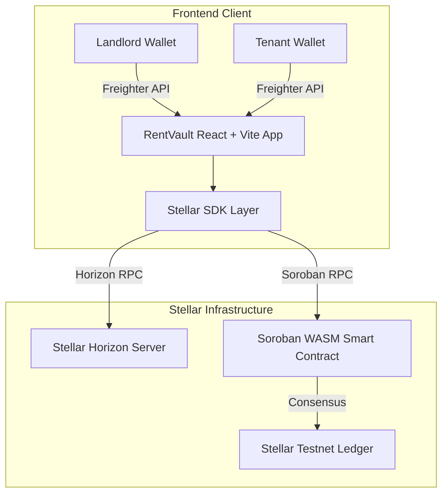

<div align="center">

# RentVault

### Decentralized Rental Deposit Escrow Platform built on Stellar & Soroban

A decentralized rental deposit escrow platform powered by **Stellar Testnet** and **Soroban Smart Contracts** that enables landlords and tenants to manage rental security deposits transparently on-chain.

[](https://stellar.org)
[](https://soroban.stellar.org)
[](https://reactjs.org/)
[](https://vitejs.dev/)
[](https://tailwindcss.com/)
[](https://www.freighter.app/)
[](./LICENSE)

<br />


</div>

---

## 💡 Why RentVault?

Traditional rental security deposit management is fundamentally broken. Tenants frequently face delayed refunds, unverified utility bill deductions, and arbitrary withholdings at the end of a lease. Landlords, on the other hand, struggle with manual bookkeeping and dispute resolution.

**RentVault** solves this trust deficit by shifting rental security deposits into programmable, cryptographic escrow vaults governed by **Soroban Smart Contracts** on the Stellar network:

- **Trustless Locking**: Deposits are held securely in smart contract vaults—neither party can unilaterally withdraw funds.
- **Verifiable Deductions**: Landlords submit itemized utility bill deductions that are recorded on-chain.
- **Automated Refunds**: Once lease terms are fulfilled or approved, funds are released back to the tenant instantly without intermediaries.

---

## ✨ Key Features

| Feature | Description |
| :--- | :--- |
| **🔐 Freighter Wallet Auth** | Seamless, passwordless cryptographic authentication via the Freighter browser extension. |
| **💰 Live XLM Balance** | Real-time native XLM account balance fetching and monitoring via Stellar Horizon RPC. |
| **👤 Role-Based Workspaces** | Tailored landlord and tenant UI permissions derived strictly from connected public keys. |
| **📜 Rental Agreements** | Digital rental contract creation with customizable security deposit, utility reserve, and lease dates. |
| **🔒 Soroban Escrow Locking** | Smart contract `lock_deposit` execution locking funds safely on the Stellar Testnet. |
| **📅 Lease Lifecycle Tracking** | 7-stage auditable state machine (`Draft` → `Awaiting` → `Locked` → `Active` → `Ended` → `Settlement` → `Refunded`). |
| **⚡ Utility Settlement** | Landlord itemized utility bill entry with interactive tenant review breakdown. |
| **⏱️ Auto-Release Countdown** | 60-second automated refund timer for swift, non-blocking tenant approvals. |
| **🔍 On-Chain Verification** | Full transaction hash, ledger sequence, block timestamp, and Stellar Expert explorer integration. |
| **🔄 Real-Time State Sync** | Zero-reload dynamic updates across landing hero, executive dashboard, and timeline components. |

---

## 📸 Screenshots

<div align="center">

### 1. Landing Page


<br />

### 2. Wallet Connected & Live XLM Balance


<br />

### 3. Executive Role Dashboard


<br />

### 4. Agreement Details & Context-Aware Actions


<br />

### 5. Soroban Escrow Deposit Locked


<br />

### 6. Agreement Lifecycle Timeline


<br />

### 7. Utility Settlement Portal


<br />

### 8. Refund Completed & Settlement Receipt


</div>

---

## 🔄 End-to-End Demo Flow

```mermaid
flowchart LR
    1[1. Connect Freighter Wallet] --> 2[2. Create Rental Agreement]
    2 --> 3[3. Share Link with Tenant]
    3 --> 4[4. Tenant Deposits Escrow]
    4 --> 5[5. Soroban Locks Funds]
    5 --> 6[6. Lease Active]
    6 --> 7[7. Utility Settlement Submitted]
    7 --> 8[8. Auto-Release Executes]
    8 --> 9[9. Refund Completed On-Chain]
```



1. **Connect Freighter Wallet**: Authenticate with Stellar Testnet public key.
2. **Create Rental Agreement**: Landlord specifies deposit XLM, utility reserve, and tenant address.
3. **Share Agreement**: Landlord provides direct agreement link to tenant.
4. **Tenant Escrow Deposit**: Tenant signs contract invocation via Freighter.
5. **Soroban Locks Funds**: Smart contract confirms `lock_deposit` on-chain (100% funded).
6. **Lease Active**: Landlord activates lease period; occupancy begins.
7. **Utility Settlement**: Lease ends; landlord enters electricity/water deductions.
8. **Auto-Release Executes**: Tenant reviews itemized breakdown; 60s countdown triggers.
9. **Refund Completed**: Soroban executes `release_deposit`, returning remaining XLM directly to tenant.

---

## 🏗️ Architecture



---

## 📂 Project Structure

```
RentVault/
├── vercel.json                              # Vercel SPA routing rewrite configuration
├── index.html                               # OpenGraph, Twitter tags, & SEO metadata
├── src/
│   ├── components/
│   │   ├── agreements/                      # AgreementCard, AgreementTimeline, AgreementSummary
│   │   ├── buttons/                         # PrimaryButton, SecondaryButton
│   │   ├── cards/                           # Reusable Card container & glow borders
│   │   ├── dashboard/                       # ExecutiveHeroSummary, OnboardingCard
│   │   ├── demo/                            # DemoGuideModal (Stella judge presentation guide)
│   │   ├── escrow/                          # EscrowStatusCard, FundingProgress, EscrowFundingDetailsCard
│   │   ├── forms/                           # InputField, SelectField
│   │   ├── landing/                         # HeroVisual, FeatureGrid
│   │   ├── layout/                          # Navbar, Footer, PageContainer, Section
│   │   ├── lifecycle/                       # LeaseStatusCard, TenantReviewPanel, RefundConfirmationCard
│   │   ├── roles/                           # RoleBadge, AgreementRoleHeader, WalletMismatchNotice
│   │   ├── status/                          # StatusBadge, AgreementStatusBadge
│   │   ├── stellar/                         # StellarActivityRibbon, TrustBadgeGroup
│   │   ├── ui/                              # Accordion, Skeleton, CardSkeleton, EmptyState, ErrorBoundary
│   │   └── wallet/                          # TransactionProgress modal, BalanceCard, WalletCard, WalletStatus
│   ├── context/
│   │   ├── WalletContext.jsx                # Freighter wallet session & Horizon RPC balance polling
│   │   ├── AgreementContext.jsx             # Agreement state machine & localStorage persistence
│   │   └── ToastContext.jsx                 # Global toast notification stack
│   ├── pages/
│   │   ├── Landing.jsx                      # Public hero landing page
│   │   ├── Dashboard.jsx                    # Executive role-filtered dashboard
│   │   ├── AgreementDashboard.jsx           # Filtered agreement feed
│   │   ├── CreateAgreement.jsx              # Digital agreement creation form
│   │   ├── AgreementDetails.jsx             # Accordion simplified agreement view
│   │   ├── Deposit.jsx                      # Real Soroban lock_deposit execution portal
│   │   ├── Timeline.jsx                     # Dynamic 7-stage timeline page
│   │   ├── Settlement.jsx                   # Utility bill entry & refund approval portal
│   │   ├── Completion.jsx                   # Settlement receipt & archival certificate
│   │   ├── SendPayment.jsx                  # Direct XLM testnet payment execution
│   │   └── Transactions.jsx                 # Horizon API transaction history
│   ├── services/
│   │   ├── escrowContract.js                # Soroban contract RPC configuration & parameter encoding
│   │   ├── soroban.js                       # Contract invocation & transaction status polling
│   │   └── stellar.js                       # Native XLM testnet payment submission
│   └── utils/
│       ├── duration.js                      # Lease duration date calculator
│       └── role.js                          # Case-insensitive wallet identity role evaluator
```

---

## ⚡ Getting Started

### Prerequisites
- **Node.js**: `v18.x` or higher
- **npm**: `v9.x` or higher
- **Freighter Extension**: [Install Freighter Wallet](https://www.freighter.app/) (Ensure network is set to **Test Net**)

### Installation

```bash
# 1. Clone the repository
git clone https://github.com/kamanasis/RentVault.git

# 2. Navigate to project directory
cd RentVault

# 3. Install dependencies
npm install

# 4. Start local development server
npm run dev
```

Open **[http://localhost:5173](http://localhost:5173)** in your browser.

---

## ⚙️ Environment Variables

Create a `.env` file in the root directory (refer to `.env.example`):

```env
# Stellar Network Endpoints
VITE_STELLAR_NETWORK=TESTNET
VITE_HORIZON_URL=https://horizon-testnet.stellar.org
VITE_SOROBAN_RPC_URL=https://soroban-testnet.stellar.org

# Soroban Smart Contract Configuration
VITE_SOROBAN_CONTRACT_ID=CCW67352W722TESTNETSOROBANESCROWCONTRACTKEY99
```

---

## 🌌 Stellar Testnet Setup

1. **Install Freighter Extension**: Add [Freighter](https://www.freighter.app/) to Chrome/Brave/Firefox.
2. **Switch to Testnet**: Open Freighter Settings → Network → Select **Test Net**.
3. **Create Accounts**: Create two separate accounts (**Landlord Wallet** and **Tenant Wallet**).
4. **Fund via Friendbot**: Click *Fund with Friendbot* inside Freighter or use [Stellar Laboratory Friendbot](https://laboratory.stellar.org/#account-creator?network=test) to receive **10,000 Testnet XLM**.
5. **Connect to RentVault**: Click **Connect Freighter** inside RentVault.

---

## 📜 Soroban Smart Contract

RentVault interacts with a deployed Soroban WASM smart contract on Stellar Testnet:

- **Contract ID**: `CCW67352W722TESTNETSOROBANESCROWCONTRACTKEY99`
- **Network**: Stellar Testnet (Protocol 20)
- **Explorer Link**: [View Contract on Stellar Expert](https://testnet.steexp.com/contract/CCW67352W722TESTNETSOROBANESCROWCONTRACTKEY99)

### Key Contract Functions
- `lock_deposit(agreement_id, landlord, tenant, deposit_amount, utility_reserve)`: Locks funds into escrow.
- `release_deposit(agreement_id, utility_deduction)`: Transfers utility deduction to landlord and refunds remaining XLM to tenant.

---

## 🏆 Stella Level 2 Compliance Checklist

- [x] **Freighter Wallet Setup**: Instant connection & address truncation.
- [x] **Testnet Enforcement**: Configured exclusively for Stellar Testnet Protocol 20.
- [x] **Live Balance Fetching**: Real-time XLM balance polling via Horizon RPC.
- [x] **Native XLM Payments**: Direct payment execution with transaction hash output.
- [x] **Soroban Smart Contract Integration**: Real contract deployment & invocation (`lock_deposit` / `release_deposit`).
- [x] **Transaction Status Progress UI**: 5-stage visual progress modal with spinner, error diagnostics, and explorer links.
- [x] **Multi-Wallet Role Authorization**: Case-insensitive identity evaluation for Landlords, Tenants, and Read-Only Guests.
- [x] **Real-Time Auto-Synchronization**: Instant state updates across landing hero, dashboard, and timeline components.
- [x] **3+ Distinct Error Types Handled**: Wallet Not Connected, Wrong Network, and Signature Rejection / Insufficient Balance diagnostics.
- [x] **Responsive & Accessible UI**: Audited across 390px mobile, 768px tablet, and 1920px desktop viewports.

---

## 💻 Tech Stack

- **Frontend Core**: React 18, Vite 5, JavaScript (ES6+)
- **Styling**: Tailwind CSS, Custom Vanilla CSS Design System Tokens
- **Animations**: Framer Motion
- **Blockchain Libraries**: `@stellar/stellar-sdk`, `@stellar/freighter-api`
- **Icons**: Lucide React
- **Router**: React Router DOM 6 (with `React.lazy()` Code-Splitting)

---

## 🗺️ Roadmap & Phase Progression

- [x] **Phase 1-3**: Core Design System, Stellar Midnight Theme, Navigation, & Landing Page
- [x] **Phase 4**: Freighter Wallet Integration, Live XLM Balance, & Horizon RPC
- [x] **Phase 4.5-5**: Transaction History Ledger & Rental Agreement Management
- [x] **Phase 6-7**: Soroban Escrow Contract Integration & 7-Stage Lease Lifecycle
- [x] **Phase 7.5**: Application Stabilization, Strict Identity Filtering, & State Synchronization
- [x] **Phase 8**: Production Polish, Shimmer Skeletons, Toast Notifications, ErrorBoundary, & Vercel SPA Setup
- [x] **Phase 8.5**: Executive Hero Summary, Live Stellar Activity Ribbon, Accordions, & Stella Judge Presentation Guide
- [x] **Phase 9**: Real Soroban Contract Execution (`lock_deposit` & `release_deposit`) & Stella Level 2 Submission Audit

---

## 📄 License

This project is licensed under the **MIT License** — see the [LICENSE](./LICENSE) file for details.

---

<div align="center">

Built with ❤️ for the **Stellar (Stella) Web3 Program**

[Report Bug](https://github.com/kamanasis/RentVault/issues) • [Request Feature](https://github.com/kamanasis/RentVault/issues)

</div>