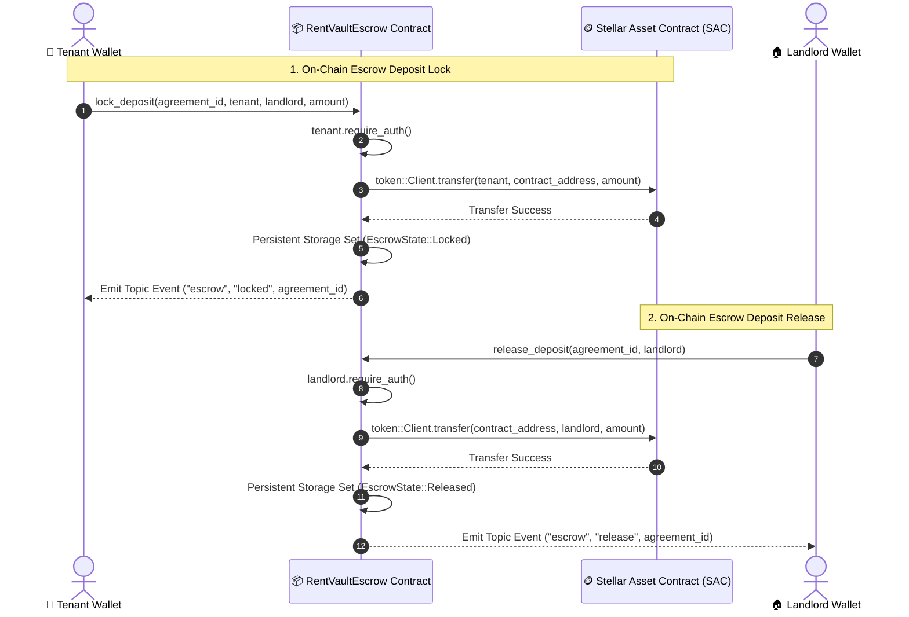

# 📜 RentVault Soroban Escrow Smart Contract

This directory contains the **Soroban Rust WebAssembly (WASM)** smart contract powering the RentVault decentralized security deposit escrow platform on **Stellar Testnet (Protocol 20)**.

---

## 🔗 Deployment Details

- **Network**: Stellar Testnet
- **Contract ID**: `CB2YAY734VGBLC4B3KGCDFSLS5JWKRCLIW4NM77VFLH32Q6JPEYLHADF`
- **Explorer Link**: [View on Stellar Lab](https://lab.stellar.org/r/testnet/contract/CB2YAY734VGBLC4B3KGCDFSLS5JWKRCLIW4NM77VFLH32Q6JPEYLHADF)
- **Verified Interaction TX**: [`2d6758e2adc05dff2f563c454034304873889d4781a114dc5d9fa69501b83593`](https://stellar.expert/explorer/testnet/tx/2d6758e2adc05dff2f563c454034304873889d4781a114dc5d9fa69501b83593)

---

## 🏗️ Architecture & Inter-Contract Communication

The RentVault contract demonstrates **Inter-Contract Communication** by interacting directly with the **Stellar Asset Contract (SAC)** to manage native XLM / token transfers:



---

## 📂 Contract Methods & Interface

### 1. `lock_deposit`
```rust
pub fn lock_deposit(
    env: Env,
    agreement_id: String,
    tenant: Address,
    landlord: Address,
    amount: i128,
)
```
- **Authorization**: Enforces `tenant.require_auth()`.
- **Validation**: Ensures `amount > 0` and prevents duplicate agreement locks.
- **Inter-Contract Call**: Transfers `amount` from `tenant` to `contract_address` via `token::Client`.
- **Storage**: Writes `EscrowState { tenant, landlord, amount, status: EscrowStatus::Locked }` into persistent storage.
- **Event**: Emits `(symbol_short!("escrow"), symbol_short!("locked")), agreement_id`.

### 2. `release_deposit`
```rust
pub fn release_deposit(
    env: Env,
    agreement_id: String,
    releaser: Address,
)
```
- **Authorization**: Enforces `releaser.require_auth()`.
- **Verification**: Confirms `releaser == state.landlord` and `state.status == EscrowStatus::Locked`.
- **Inter-Contract Call**: Transfers `amount` from `contract_address` to `landlord` via `token::Client`.
- **Storage**: Updates state to `EscrowStatus::Released`.
- **Event**: Emits `(symbol_short!("escrow"), symbol_short!("release")), agreement_id`.

---

## 🛠️ Build & Deployment Instructions

### Prerequisites
- [Rust & Cargo](https://rustup.rs/)
- `wasm32-unknown-unknown` target: `rustup target add wasm32-unknown-unknown`
- [Stellar CLI](https://developers.stellar.org/docs/tools/developer-tools/cli/stellar-cli)

### Compile WASM Bundle
```bash
cd contracts/escrow
cargo build --target wasm32-unknown-unknown --release
```

### Run Unit Tests
```bash
cargo test
```

### Deploy to Stellar Testnet
```bash
stellar contract deploy \
  --wasm target/wasm32-unknown-unknown/release/rentvault_escrow.wasm \
  --source <YOUR_STELLAR_IDENTITY> \
  --network testnet
```
